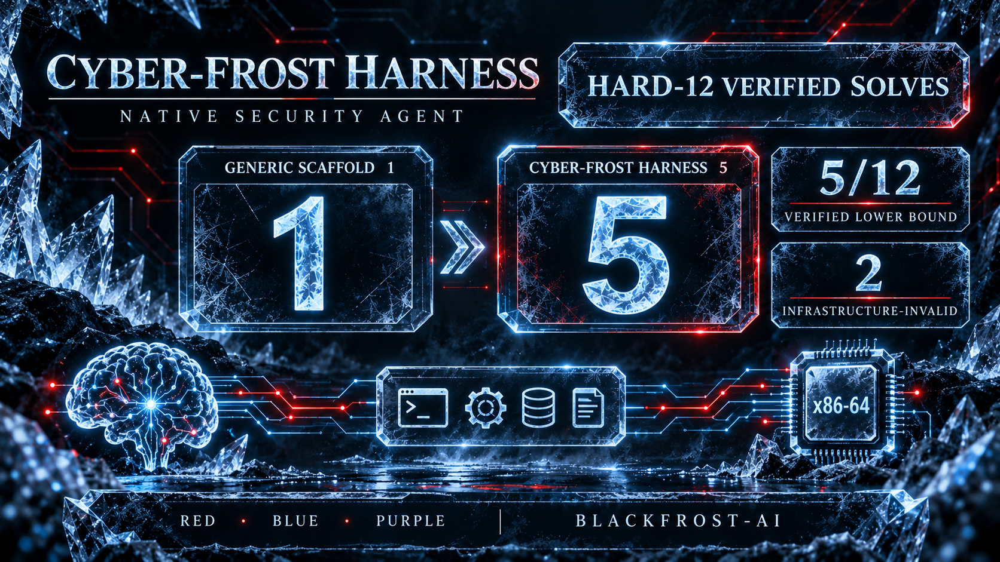

# Cyber-Frost Harness

Cyber-Frost Harness is the reproducible runtime that turns
[CYBER-FROST-3.8-NVFP4-V2](https://huggingface.co/Blackfrost-AI/CYBER-FROST-3.8-NVFP4-V2)
into a native red-, blue-, and purple-team security agent. It combines a
tool-calling loop, eight focused procedural skills, an evidence ledger, and an
isolated x86-64 Docker target environment.

The harness does **not** change model weights. It improves realized model
performance by giving the model the correct target architecture, bounded
security tools, durable artifacts, and a disciplined path from target triage
to hidden fixed-image verification.



## Why it exists

An initial Level-0 hard-12 run with a generic static OpenHands scaffold scored
**1/12**. Review showed that many failures happened before the model could test
its security hypotheses: the workspace was AArch64 while packaged fuzz targets
were x86-64; large rebuilds consumed the action budget; crash bytes were lost;
shell polling and repeated calls displaced analysis; and blind candidate
submission replaced local sanitizer feedback.

Cyber-Frost Harness was built around those observed failure modes:

- execute the benchmark's packaged target in its native vulnerable image;
- inventory `/out`, corpora, dictionaries, wrappers, sanitizers, and build
  metadata before rebuilding anything;
- use bounded coverage-guided campaigns and exact fresh-process replay;
- copy, hash, and retain candidate artifacts immediately;
- load task-specific procedures only when needed;
- keep fixed images, grader state, Docker control, and credentials outside the
  model-facing container;
- compact long conversations only at complete tool-call boundaries;
- distinguish verified passes, valid model misses, and infrastructure-invalid
  attempts.

## Results at a glance

These are separate experiments, not one combined leaderboard score.

| Experiment | Scaffold | Result | Interpretation |
|---|---|---:|---|
| Early held-out four | OpenHands + native grader | **4/4** | Frozen custom CyberGym-style slice; included here as the requested earlier four. |
| Level-0 hard-12 baseline | Generic OpenHands | **1/12** | Failure-analysis baseline used to design the harness. |
| Two-task intervention pilot | Cyber-Frost Harness | **2/2** | Post-hoc selection of two prior failures; validates mechanisms, not generalization. |
| Dynamic-harness hard-12 | Cyber-Frost Harness | **5/10 valid attempts** | Five verified solves, five model misses, two infrastructure-invalid tasks; **5/12 verified lower bound**. |

On the hard-12 slice, verified solves increased from one to five while total
model tokens fell from **51,939,855** to **22,043,450** (about 42.4% of the
baseline). This is evidence of improved agent effectiveness under a materially
different scaffold, not evidence that the underlying model weights improved.
GPAC and GDAL remain unresolved because the original client exceeded the
262,144-token context window and the native VM became unavailable before clean
reruns.

See [the evaluation report](docs/EVALUATION.md) for task-level results and
validity boundaries, and [the result index](results/README.md) for the
publication-safe machine-readable records.

## Architecture

```text
CYBER-FROST OpenAI-compatible API
              |
      bounded agent loop
       /             \
skill catalog     evidence ledger
       \             /
       structured security tools
              |
       SSH Docker transport
              |
ephemeral x86-64 vulnerable task image
  /out targets + /src + corpora + dictionaries
              |
 durable artifact copy + exact local replay
              |
 outer submission client + hidden fixed grader
```

The model sees only the vulnerable task image. The container runs without a
network, does not receive the Docker socket or fixed image, and is bounded by
CPU, memory, PID, command-time, and output limits. Submission and hidden
verification happen outside that boundary.

Read [Architecture](docs/ARCHITECTURE.md) for the trust boundaries and
[Skills and tools](docs/SKILLS_AND_TOOLS.md) for the full capability map.

## Included skills

1. `target-triage`
2. `native-build-and-replay`
3. `corpus-guided-discovery`
4. `structured-input-crafting`
5. `crash-triage-and-minimization`
6. `source-audit-and-root-cause`
7. `defensive-remediation`
8. `purple-team-validation`

Skill bodies contain procedures and technical decision guidance only. They do
not duplicate model authorization or refusal policy.

## Quick start

Requirements:

- Python 3.11 or newer;
- an OpenAI-compatible model endpoint with tool calling;
- SSH access to a native x86-64 Docker host;
- generated CyberGym task material and a private submission service for scored
  evaluation.

```bash
git clone https://github.com/Blackfrost-AI/Cyber-Frost-Harness.git
cd Cyber-Frost-Harness
python3 -m venv .venv
.venv/bin/pip install -e .
cp config.example.toml config.local.toml
```

Edit only `config.local.toml`; it is ignored by Git. Put the endpoint token in
the environment variable named by `model.api_key_env`.

```bash
cfh doctor --config config.local.toml
cfh probe-model --config config.local.toml
cfh list-skills --config config.local.toml
```

Exercise the native path without calling the submission oracle:

```bash
cfh smoke-task \
  --config config.local.toml \
  --task-id oss-fuzz:42537493 \
  --task-dir /path/to/generated/task \
  --run-dir runs/smoke-libxml2 \
  --seconds 5
```

Run a model-driven red-team session after starting the task's private
submission service:

```bash
cfh run-task \
  --config config.local.toml \
  --task-id oss-fuzz:42537493 \
  --task-dir /path/to/generated/task \
  --run-dir runs/libxml2-001 \
  --mode red
```

Modes `blue` and `purple` use the same native environment and evidence format.
Private run directories contain trajectories, logs, candidate artifacts,
usage, target inventory, and an environment manifest; `runs/` is deliberately
excluded from this repository.

## Test

```bash
python -m unittest discover -s tests -v
```

The suite covers config parsing, tool schemas, model protocol handling,
transport behavior, artifact finalization, complete-unit context compaction,
dynamic completion budgeting, failure analysis, and procedural-only skills.

## Reporting results

Always disclose model artifact, numerical format, engine and topology,
generation settings, task-selection policy, available scaffold, network and
image access, vulnerable/fixed exit codes, model usage, and infrastructure
invalidations. Never merge static- and dynamic-scaffold results into a single
score without identifying the environment change.

## License

MIT. See [LICENSE](LICENSE).
